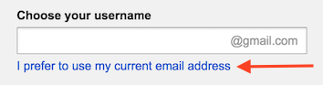
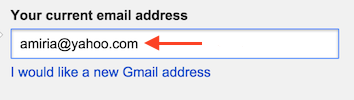

# Create Accounts!

Ngā mihi nui kia koutou katoa! Warm greetings to you all! Welcome to Dev Academy.

You will need to set up each of these accounts before starting Phase 0. The general rule of thumb is to **use your first name as part of your username wherever possible** and include a photo of yourself (i.e. not your cat or bike). This helps us (the EDA community of staff, teachers, coaches and alumni) to better support you.

## Accounts you need

1. Google
2. Gravatar
2. Github
3. Waffle.io
3. Slack
4. Toggl timer

## Google
[Google](https://accounts.google.com/Signup): To sign you up to our automated tools, we require you use the same email address that you enrolled with. We also require that email be linked to google. **This is really important**. Even if you have a second gmail address, please continue using the primary email you enrolled with and complete steps below. If you applied using a gmail, you don't need to link to google and can skip this step.

Go to [Google](https://accounts.google.com/Signup) and select the option "I prefer to use my own email address."
<figure>
   
  <figcaption>
    
<strong>Figure 1:</strong> google signup

  </figcaption>
</figure>

<figure>
   
  <figcaption>
    
<strong>Figure 2:</strong> Example email address

  </figcaption>
</figure>

 

Once your admission process is complete, you will recieve notification that you've been invited to our google group (usually 2-5 days before phase-0 begins.) Only then will these links to our google drive work.

- [Google groups / Google drive](https://drive.google.com/a/enspiral.com/folderview?id=0B5aB0OHeInzgeWZoQm9VaWJQeWc&usp=sharing): This is a mailing list for your cohort (e.g. Kakapo-2015@devacademy.co.nz) and provides access to learning materials stored on the student drive.

## Gravatar
[Gravatar](http://en.gravatar.com/): Github will pull your picture from Gravatar. Please make sure your picture is of your face to help us recognise you.

## Github
- [Github](https://github.com/): Please create an account with **your first name as part of your github user name.** This will be where you keep all of your code from EDA and becomes your technical resume when applying for positions. The most popular form for github usernames is to use "snake-case": all lowercase letters with words separated by hyphens, e.g., bobs-yer-uncle. Remember that this name will be used by you professionally, so don't make the mistake of  using something you wouldn't want potential employers or clients to see. 'anahi-hiyu' == good. 'eda-2015-sam-coder' == not so good. Make sure it sends the right message.

- Go to your profile page in github, then click `edit settings`>`notification center` and uncheck all the `how you receive notifications` boxes.

- **You will be sent an invitation to your cohort's github team, by email. It will come by email by the time the course starts. You must accept this invitation to access assignments and course content**

## Waffle.io
- Sign up to [Waffle.io](https://waffle.io/) using your GitHub account - **select private repos**.
- Watch this [tutorial on assignment management in waffle](https://vimeo.com/147405661). The password is `eda`.

## Slack
[Slack](https://edaslackinvite.herokuapp.com/): Slack is where cohort communications and technical support happens. Once you have [signed up for our EDA slack community](https://edaslackinvite.herokuapp.com/) **Please download the [desktop app](https://slack.com/apps)** and have it open when working on the material. For more information see [EDA Slack user guide](/4-tools/slack/README.md):
  
## Toggl
- [Sign up for Toggl timer](https://toggl.com/)
- [Get the Toggl Chrome extension](https://chrome.google.com/webstore/detail/toggl-button/oejgccbfbmkkpaidnkphaiaecficdnfn?hl=en)

You'll use the toggl buttons on your assignment waffle cards to record how much time you spend doing each assignment. Keeping track of time spent on each assignment, and each sprint, provides good feedback for you and for us. It's a reminder to focus on the assignment, keep to your timeboxes, and figure out if it's time to ask for help.

## Optional
- [Meetup](http://www.meetup.com/Enspiral-Dev-Academy-Meetup/): Meetup is the channel by which we advertise our coding events. It's also a great resource to find out what tech events are happening in your region. If choosing to sign up, we recommend changing the [default email settings](http://www.meetup.com/account/comm/) to reduce the number of emails.

## Next up:
[Prepare for orientation](/0.2-prepare-for-orientation/README.md)
