For general information about Git and GitHub see [git and GitHub intro](../git-and-github)

# GitHub

To pass copies of the your repository around to your team, you need a place to put a copy where everyone on your team can have access to it. That is what GitHub does. Really, that's almost all it does: provide a place for you to store your code.

As part of your preparation for Phase-0 you should have set up an account on [GitHub](https://GitHub.com/) using your first name as part of your GitHub user name. If not, go set one up right now. Note that the general practice on GitHub is to use "train-case" (all lowercase letters with words separated by hyphens). So if you're name were Mohandas K. Gandhi, your GitHub username would be `mohandas-k-gandhi`, or just `mohandas-gandhi`. In the future, you may be involved in many projects involving GitHub, using your own name for your GitHub account, where possible, works best.

Once you have an account, you can create your first repository. Then we'll clone it to your new virtual machine.

# GitHub workflow:

This is an example of how you will be interacting with GitHub each week.

You will learn how to
* Create a standard workspace directory (A folder which will hold all of your EDA repositories)
* Create a repository (E.g. `sprint-1)
* Clone it, make changes to it, commit them and push to GitHub

Estimated time to complete: 10 minutes

## Step 1: Create a repo

To create the repository for this week, go to your GitHub profile page. Mine is `https://github.com/chasm/`. Click on the **Repositories** tab and then on the big green button that says **New**.

You should see the page below, except with your username, of course.

Set the Repository name to `sprint-1` (or the equivalent e.g. `sprint-2` if you are in week 2). Add a description. Make sure it's Public. Check the box next to `Initialize this repository with a README`: *make sure you do this*.

Then click that big green `Create repository` button. C'mon. You know you want to.

<figure>
  <br>
  <figcaption>
    <p><strong>Figure 1:</strong> Creating a new GitHub git repository</p>
  </figcaption>
</figure>

Great. You've got a repo! Now we need to clone our repo into your working folder.
You should see an "Https clone URl" to the right of your newly cloned repo (image below). Click that little clipboard button to copy the URL of the repository to your clipboard.

<figure>
  <br>
  <figcaption>
    <p><strong>Figure 2:</strong> Click on that clipboard to copy the clone URL to your clipboard!</p>
  </figcaption>
</figure>

## Step 2: Go to your working folder

We've added a folder inside your home folder called "workspace". This is a common convention. You should put all your repositories in this folder so they are easy to find and keep track of.

- Open the terminal on your virtual machine.
- Type `cd ~/workspace`.

## Step 3: Clone your repo to workspace

- Inside the workspace directory clone the repo into your workspace. Do this by pasting the copied link from the GitHub repo that you created in Step one, (figure 2). E.g. `git clone https://the-link-you-copied-when-you-created-your-repo.git`.

<figure>
  <br>
  <figcaption>
    <p><strong>Figure 3:</strong> Clone the repo into your workspace folder</p>
  </figcaption>
</figure>

- Move into your repo's folder using the `cd` command, e.g., `cd sprint-1`.
- View the contents of the folder using `ls -al`. You should see the sprint file you just created.
- Open the cloned file in Sublime Text 3 using the command `subl .`.

<figure>
  <br>
  <figcaption>
    <p><strong>Figure 4:</strong> CD into the repo and open it in Sublime</p>
  </figcaption>
</figure>

## Step 4: Create a new file in your directory

Now Sublime has opened in the `sprint-1` folder and I see this:

<figure>
  <br>
  <figcaption>
    <p><strong>Figure 5:</strong> The repo open in Sublime Text 3</p>
  </figcaption>
</figure>

- Use `Control-s` to open the Save dialog. Note that it opens in the root folder of your project.
- Type the name of the file you want to save. Here we'll use `test.md`.
- Click the Save button or hit the Enter key to save the file.

<figure>
  <br>
  <figcaption>
    <p><strong>Figure 6:</strong> Creating a new file called <code>test.md</code> in Sublime Text 3</p>
  </figcaption>
</figure>

- Now add some example text to the file. Note that when the changes to a file are unsaved, the little `x` in the tab changes to a dot.
- Use `Control-s` again to save your changes. As the file already has a name, the Save dialog will not open. The changes will be saved and the dot on the tab will change back to the `x`.

<figure>
  <br>
  <figcaption>
    <p><strong>Figure 7:</strong> Adding example text (before saving).</p>
  </figcaption>
</figure>

## Step 6: Stage files to be committed

So now we have these changes on our computer, but only in our folder. The changes have not been recorded by the repository, neither have they been pushed up to GitHub. So let's do that. You should save, stage and commit changes, and push them to GitHub *very* frequently. Waiting until you've finished a project or even a significant amount of work before committing the changes defeats the purpose of a version control system! So commit frequently and push regularly.

Before we can commit the files to the repository, we have to "stage" them. This is how we tell git which files we want to put in the repository. It's kind of like putting things in a box by the front door so you remember to move them to the garage for storage.

You can stage individual files with `git add <filename>`, so we could stage our `test.md` file with `git add test.md`. We can also stage all the files we've added or changed (or deleted) with the flag `-A`.

But first, let's see what changes there are to be added. We can check this at any time with `git status`. Then we'll stage the files with `git add -A`, and then we'll run `git status` again to see what has changed.

<figure>
  <br>
  <figcaption>
    <p><strong>Figure 8:</strong> Staging the <code>test.md</code> file.</p>
  </figcaption>
</figure>

Notice that before we staged the file, git listed it as "Untracked". And red.

After we've staged the file it is listed as "Changes to be committed". And it's green. Which is nice. Unless you have red-green color blindness! Good thing that there are more indicators than just color, right?

## Step 7: Commit changes to your local repo

Now we can commit the changes. We'll need to add a "commit message" to explain what the commit is about. Commit messages are very important. Be sure you write good ones. There has been a lot of controversy about just what that means, but the general consensus seems to be that the title of the message should begin with an *imperative* verb, for example "Add", not "Added". You are telling future developers what this commit will *do* if they run it, not reporting what *you* did before you made the commit.

The message should be no more than about 50-60 characters and should not end in a period. Think of it like a title or headline. They don't end in periods, do they?

Making [good commit habits](https://xkcd.com/1296/) early will save you a lot of pain later, and will look good should you want to get involved in some of the major open source projects. They are not very forgiving about bad commit messages! Looks good for employers, too, and it's just respectful of future developers (and yourself if you come back to your code later).

So let's commit our changes to our *local* copy of the repository:

```sh
git commit -m "Add sample text"
```

<figure>
  <br>
  <figcaption>
    <p><strong>Figure 9:</strong> Oops. Something went wrong.</p>
  </figcaption>
</figure>

## Step 8: Add credentials and try again

Well, that didn't work as expected! This is because git wants to know who we are for the records. This is a setting you'll only need to set once (unless you back up to an earlier snapshot of the VM or re-download it). But it's easy! The error message tells you exactly what to do. So we can simply copy and paste, making the appropriate changes. (Remember that copying from the terminal in Linux uses `Control-SHIFT-c`, and pasting `Control-SHIFT-v`.)

```sh
git config --global user.email "you@example.com"
git config --global user.name "Your Name"
```

<figure>
  <br>
  <figcaption>
    <p><strong>Figure 10:</strong> Completing our commit.</p>
  </figcaption>
</figure>

Well, that worked! Next time we can go straight to the commit. Something to note: Before we did the commit, the prompt included this text: `<master*>`. That means we're on the "master" branch of our code (more on that shortly), and the * means that we have uncommitted changes. Note that after the commit succeeds, that * goes away. So you can quickly see from the terminal both what branch you're on and whether it currently has changes to be committed.

## Step 9: Push files to GitHub

Now we can push our commited changes, which are only in our local copy of the repository, up to GitHub so they are both save and visible to others (such as your instructors). Do this often, so if you need help from a teammate or instructor, you can just pass them the URL of the page and a line number. That saves a lot of copying and pasting and confusion.

We push the changes to GitHub with a simple `git push`:

<figure>
  <br>
  <figcaption>
    <p><strong>Figure 11:</strong> Pushing our changes to GitHub.</p>
  </figcaption>
</figure>

Hmm. Another big mess, eh? This is another setting that git requires. Well, it let us push, so maybe requires is the wrong word. But it will keep bugging us about this until we make a choice. So let's just use the newer setting:

```sh
git config --global push.default simple
```

<figure>
  <br>
  <figcaption>
    <p><strong>Figure 12:</strong> Setting the push.default for all time!</p>
  </figcaption>
</figure>

## Step 10: Create a branch

Normally, we don't work in the "master" branch of our code. What we'll do is to create a separate "feature" branch, named after whatever feature we're adding to our code, and we'll work in that. Git will keep the two branches separate, so my code in the master branch remains the same despite my changes in the feature branch.

There are two parts to working in a branch. The first is creating the branch. The second is "checking it out", that is, moving into that branch to work.

Later, when we have completed the feature and want it in our code, we'll "merge" that branch back into master. Then we can leave the feature branch there, do more work in it, delete it&mdash;whatever we want.

If we (or another teammate) have made changes in the master branch since we created our feature branch, it is possible that there could be a conflict between those changes and the ones we made in our branch. There are serveral ways of dealing with these conflicts. The most common is to let git merge what it can, and then to fix those conflicts it can't.

When git can handle the merge without conflicts, it calls this "fast-forwarding". We'll learn much more about merging, conflicts, and how to deal with them in the coming weeks.

For now, we can both create a new branch *and* check it out with a single command:

```sh
git checkout -b sample-feature
```

The `-b` tells git to create the branch. `checkout` checks it out. `sample-feature` is the name of our example new branch. In reality, you'd name it something such as `log-in-dialog` (assuming you were adding a log-in dialog, of course).

<figure>
  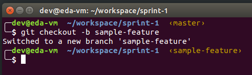<br>
  <figcaption>
    <p><strong>Figure 13:</strong> Creating and checking out a new branch</p>
  </figcaption>
</figure>

Notice how the name of the branch has changed from "master" to "sample-feature". We can go back and forth between branches with `git checkout <branch-name>`. So `git checkout master` takes me back to master and `git checkout sample-feature` would then bring me back to this branch.

## Step 11: Pushing the new branch

The branch we created is in our local repository only. If we want to push a copy to the remote repository (GitHub, known as the "origin"), then we'll need to specify both the remote repository and our local branch. Let's start by making some changes to our branch.

<figure>
  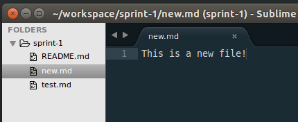<br>
  <figcaption>
    <p><strong>Figure 14:</strong> Changes to the sample-feature branch</p>
  </figcaption>
</figure>


Then we'll stage and commit our changes, then we'll push and create the new remote branch.

```sh
git push origin sample-branch
```

<figure>
  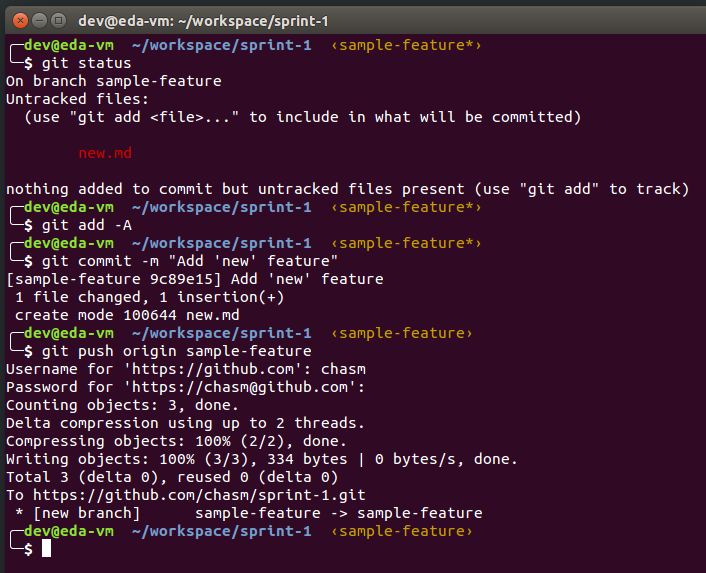<br>
  <figcaption>
    <p><strong>Figure 15:</strong> Pushing the new branch to GitHub (origin)</p>
  </figcaption>
</figure>

Unfortunately, even though we've done this, git doesn't automatically remember that the remote branch is supposed to track our local one. If we try to push again, we'll get an error message. Conveniently, it provides the solution. All we need to do is copy and paste this line (yours will be different if you have a different branch name, of course):

```sh
git push --set-upstream origin sample-feature
```

Now we can push to our hearts content with nothing more than `git push`. Of course, we could have added that `--set-upstream` flag the first time we pushed&mdash;if we could remember it&mdash;but git kindly reminds us if we just try it without that flag first.

<figure>
  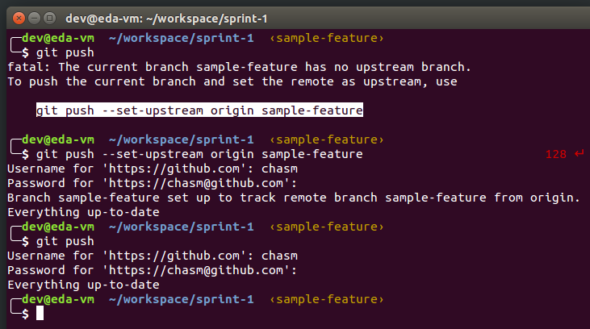<br>
  <figcaption>
    <p><strong>Figure 16:</strong> Telling git which remote branch tracks this one</p>
  </figcaption>
</figure>

## Step 12: Merging changes back into master

Now that we've committed and pushed our changes to the sample-feature branch, we can merge those changes back into master. First, we checkout master with `git checkout master`. Then we merge our feature branch with `git merge sample-feature`. Because we've made no conflicting changes to master in the meantime, we can "fast-forward" the changes and the merge is simple.

<figure>
  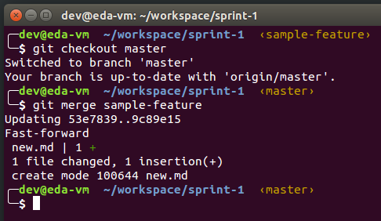<br>
  <figcaption>
    <p><strong>Figure 16:</strong> "Fast-forward" merging sample-feature into master</p>
  </figcaption>
</figure>

## Forks and pull requests

Forks and pull requests are not a feature of git, but of GitHub. They are a way of working with repositories online *without having direct access to that repository*.

For example, suppose that you want to help us to fix a typo in this repository. If you lack permission to commit changes to this repository, then that makes it difficult, no? You can clone the repository, but when you try to push changes you'll get a message that you don't have the authority to do so.

But not all is lost! You can "fork" your own copy of our repo, and then clone that. You make changes to your own copy and push them to your forked repo. Then you create a "pull request" that let's us know that you have changes you'd like us to incorporate into our canonical repo. We can see the changes, and we can agree to incorporate them or not. It's up to us.

This is how many open source projects work if you're not a "committer"&mdash;i.e., not someone who has the authority to make commits and pushes to the actual repo. For such circumstances, you'll fork a copy, make your changes (or your "patch" to their code), and then submit a pull request. If they like what you did, they'll pull the changes into the official repo. If you do this often enough, they might even invite you to become a "committer". Big prestige points!

So how do we do this. Well, *we have to do it from GitHub*, of course, because it's a GitHub feature not a git feature.

We go to the official repository we want to clone. For example, suppose I wanted to clone this Orientation repository to my personal GitHub account. I go to the repository page and click the "Fork" button in the upper right corner. GitHub asks me where I want to fork it to (maybe not if you only have one account!), I choose which organization to fork it to, and presto! I have my own copy.

<figure>
  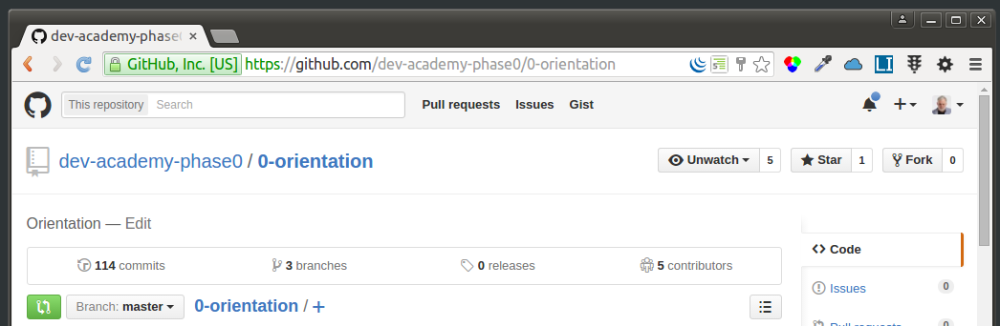<br>
  <figcaption>
    <p><strong>Figure 17:</strong> Click the "Fork" button to fork the repo</p>
  </figcaption>
</figure>

After I've forked the repository to my own account, it looks like this. Notice that we're not on *my* account, not "dev-academy-phase0", and that next to the "Fork" button, the number of forks is now 1.

<figure>
  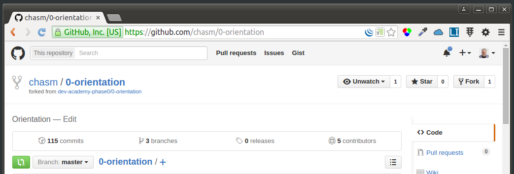<br>
  <figcaption>
    <p><strong>Figure 17:</strong> The repo is now "forked" onto my personal account</p>
  </figcaption>
</figure>

I can now clone this to my development machine, make changes, commit them, etc. Here I clone the forked repo:

<figure>
  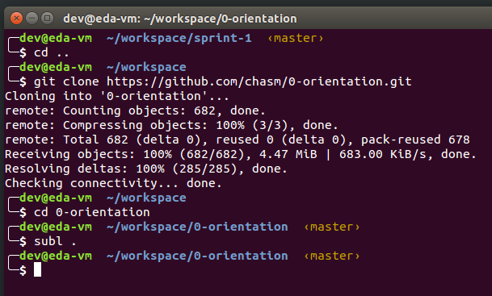<br>
  <figcaption>
    <p><strong>Figure 18:</strong> Now I've changed folders, cloned the fork, and opened it in Sublime</p>
  </figcaption>
</figure>

I made a small change in a file using Sublime Text 3, then saved the change. Now I do the normal staging, commit and push:

<figure>
  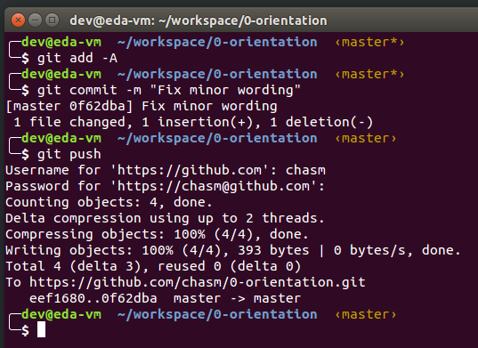<br>
  <figcaption>
    <p><strong>Figure 19:</strong> After making my changes, I stage, commit, and push normally</p>
  </figcaption>
</figure>

Now we can go back to *my* GitHub account and create a pull request. To the right we should see a Pull request tab (see image above). If I click on that, then click the big, green "New pull request" button, then we arrive at the form to create the pull request. There are select boxes from which we can select the "from" and "to" repositories/branches. I'll leave them where they are.

<figure>
  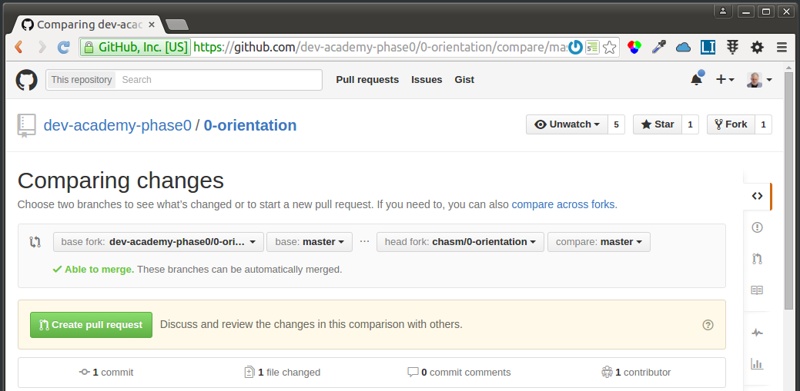<br>
  <figcaption>
    <p><strong>Figure 20:</strong> Next-to-last step before creating the pull request</p>
  </figcaption>
</figure>

We can also scroll down to see what has changed in this pull request. This is called a "diff" and it only shows what lines will be removed (-) and what lines will be added (+). To create the pull request, we click the big, green "Create pull request" button. Next we'll have a chance to name and comment on our pull request before submitting it for reals.

<figure>
  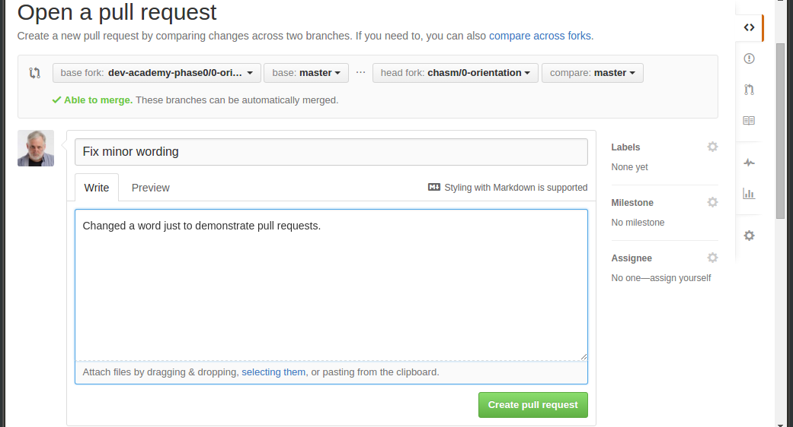<br>
  <figcaption>
    <p><strong>Figure 21:</strong> Last step before creating the pull request</p>
  </figcaption>
</figure>

Click the big, green "Create pull request" button (another one!), and the pull request is on its way to the owners of the official "canonical" repo.

Now, if we were those owners, we'd see a pull request show up on our repo. (Note that do this from the original repository, not our fork!)

<figure>
  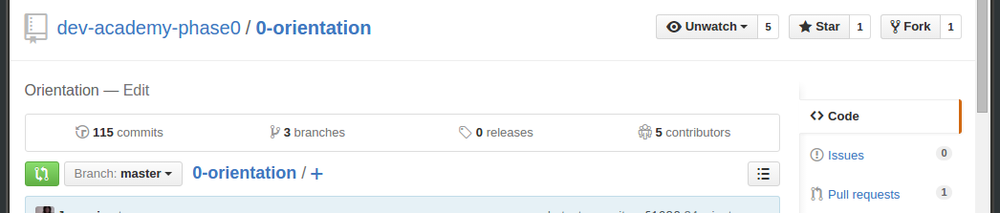<br>
  <figcaption>
    <p><strong>Figure 22:</strong> The owners of the official repo see our pull request</p>
  </figcaption>
</figure>

As an owner, I can click on "Pull requests" and see the waiting pull requests:

<figure>
  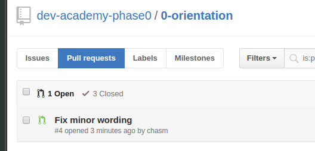<br>
  <figcaption>
    <p><strong>Figure 22:</strong> Waiting pull requests</p>
  </figcaption>
</figure>

I can click on the "Fix minor wording" pull request to check it out before accepting or rejecting it.

<figure>
  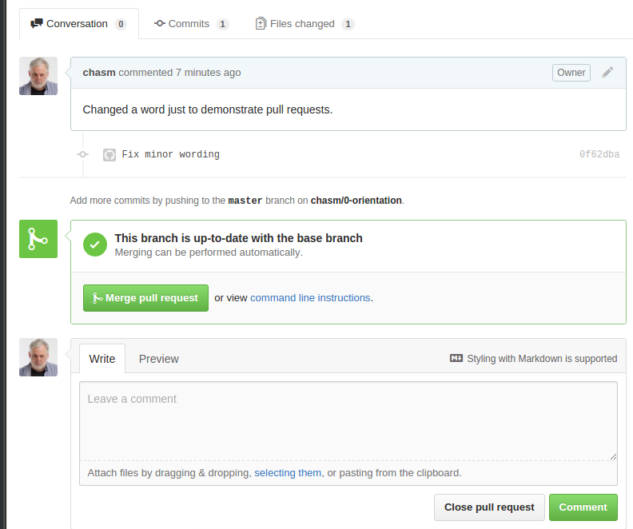<br>
  <figcaption>
    <p><strong>Figure 23:</strong> Merge or close the pull request</p>
  </figcaption>
</figure>

I can comment on the request (and conduct a discussion with the person who made the pull request as well as others on my team). I can accept it and merge it in. Or I can close it without merging it.

And that's all there is to forking and pull requests. You'll be using them a lot.

# Code reviews

We'll try to review your code each week, time permitting. To do this, we'll fork a copy of your repository to one of our GitHub accounts. Then we'll clone it to our development machine.

In our forked and cloned copy, we'll add a folder called `review` with a file in it called `README.me`. (The README.md file is a [Markdown-enabled](https://help.github.com/articles/github-flavored-markdown/) file that GitHub will display automatically when you click on this folder. This saves you the trouble of opening the file directly.)

We'll add any notes we have about your sprint to this `review/README.md` file. Then will save it, stage it, commit it, and push it to our forked copy of your repository.

Finally, we'll go to GitHub and will create a pull request for you. You should get notification that a pull request is waiting. You can merge the pull request into your repository (or just follow the link to our forked copy and read it there).

# Empathy reflection workflow

1. Go to [https://github.com/dev-academy-phase0/karearea-2015-ee](https://github.com/dev-academy-phase0/karearea-2015-ee)
2. Clone the repo to your machine
3. `cd` into the repo
4. Make a branch with your name `git checkout -b <your GitHub name>`. Be sure to replace `<your GitHub name>` with *your* GitHub name!
5. Write some reflections
6. Commit your changes
7. Push changes to your branch on the remote (GitHub)
   - The first time, use `git push --set-upstream origin <your GitHub name>`
   - thereafter, git knows where you want to push - `git push` is sufficient.
8. Repeat steps 5 - 7 until you've finished reflecting
9. Create a pull request - go back to [https://github.com/dev-academy-phase0/karearea-2015-ee](https://github.com/dev-academy-phase0/karearea-2015-ee) and submit a pull request from your branch to master. many ways to do this, ask if you're stuck.
