For general information about Git and GitHub see [git and GitHub intro](../git-and-github)

# GitHub

To pass copies of the your repository around to your team, you need a place to put a copy where everyone on your team can have access to it. That is what GitHub does. Really, that's almost all it does: provide a place for you to store your code.

As part of your preparation for Phase-0 you should have set up an account on [GitHub](https://GitHub.com/) using your first name as part of your GitHub user name. If not, go set one up right now. Note that the general practice on GitHub is to use "train-case" (all lowercase letters with words separated by hyphens). So if you're name were Mohandas K. Gandhi, your GitHub username would be `mohandas-k-gandhi`, or just `mohandas-gandhi`. In the future, you may be involved in many projects involving GitHub, using your own name for your GitHub account, where possible, works best.

Once you have an account, you can create your first repository. Then we'll clone it to your new virtual machine.

# GitHub workflow:
This is an example of how you will be interacting with GitHub each week.

You will learn how to
* Create a standard workspace directory (A folder which will hold all of your EDA repositories)
* Create a repository (E.g. `sprint-1)
* Clone it, make changes to it, commit them and push to GitHub

Estimated time to complete: 10 minutes

## Step 1: Create a repo

To create the repository for this week, go to your GitHub profile page. Mine is `https://github.com/chasm/`. Click on the **Repositories** tab and then on the big green button that says **New**.

You should see the page below, except with your username, of course.

Set the Repository name to `sprint-1` (or the equivalent e.g. `sprint-2` if you are in week 2). Add a description. Make sure it's Public. Check the box next to `Initialize this repository with a README`: *make sure you do this*.

Then click that big green `Create repository` button. C'mon. You know you want to.

<figure>
  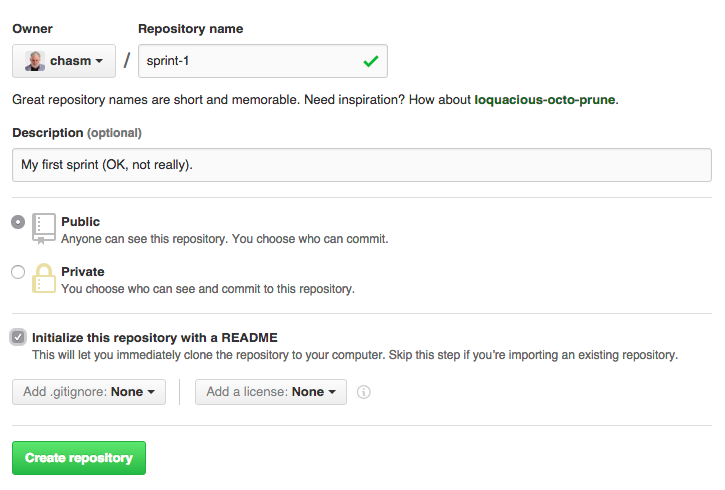<br>
  <figcaption>
    <p><strong>Figure 1:</strong> Creating a new GitHub git repository</p>
  </figcaption>
</figure>

Great. You've got a repo! Now we need to clone our repo into your working folder.
You should see an "Https clone URl" to the right of your newly cloned repo (image below). Click that little clipboard button to copy the URL of the repository to your clipboard.

<figure>
  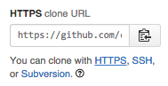<br>
  <figcaption>
    <p><strong>Figure 2:</strong> Click on that clipboard to copy the clone URL to your clipboard!</p>
  </figcaption>
</figure>

## Step 2: Go to your working folder

We've added a folder inside your home folder called "workspace". This is a common convention. You should put all your repositories in this folder so they are easy to find and keep track of.

- Open the terminal on your virtual machine.
- Type `cd ~/workspace`.

## Step 3: Clone your repo to workspace

- Inside the workspace directory clone the repo into your workspace. Do this by pasting the copied link from the GitHub repo that you created in Step one, (figure 2). E.g. `git clone https://the-link-you-copied-when-you-created-your-repo.git`.

<figure>
  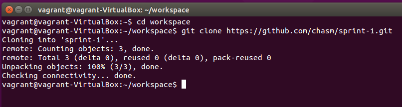<br>
  <figcaption>
    <p><strong>Figure 3:</strong> Clone the repo into your workspace folder</p>
  </figcaption>
</figure>

- Move into your repo's folder using the `cd` command, e.g., `cd sprint-1`.
- View the contents of the folder using `ls -al`. You should see the sprint file you just created.
- Open the cloned file in Sublime Text 3 using the command `subl .`.

<figure>
  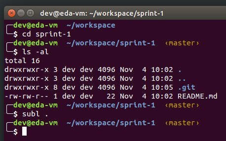<br>
  <figcaption>
    <p><strong>Figure 4:</strong> CD into the repo and open it in Sublime</p>
  </figcaption>
</figure>

## Step 4: Create a new file in your directory

Now Sublime has opened in the `sprint-1` folder and I see this:

<figure>
  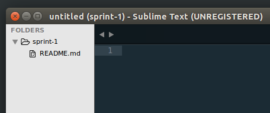<br>
  <figcaption>
    <p><strong>Figure 5:</strong> The repo open in Sublime Text 3</p>
  </figcaption>
</figure>

- Use `Control-s` to open the Save dialog. Note that it opens in the root folder of your project.
- Type the name of the file you want to save. Here we'll use `test.md`.
- Click the Save button or hit the Enter key to save the file.

<figure>
  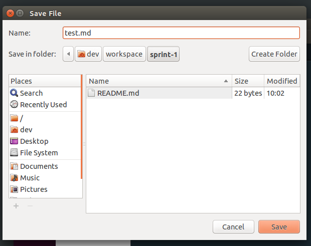<br>
  <figcaption>
    <p><strong>Figure 6:</strong> Creating a new file called <code>test.md</code> in Sublime Text 3</p>
  </figcaption>
</figure>

- Now add some example text to the file. Note that when the changes to a file are unsaved, the little `x` in the tab changes to a dot.
- Use `Control-s` again to save your changes. As the file already has a name, the Save dialog will not open. The changes will be saved and the dot on the tab will change back to the `x`.

<figure>
  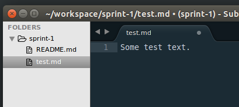<br>
  <figcaption>
    <p><strong>Figure 7:</strong> Adding example text (before saving).</p>
  </figcaption>
</figure>

## Step 6: Stage files to be committed

So now we have these changes on our computer, but only in our folder. The changes have not been recorded by the repository, neither have they been pushed up to GitHub. So let's do that. You should save, stage and commit changes, and push them to GitHub *very* frequently. Waiting until you've finished a project or even a significant amount of work before committing the changes defeats the purpose of a version control system! So commit frequently and push regularly.

Before we can commit the files to the repository, we have to "stage" them. This is how we tell git which files we want to put in the repository. It's kind of like putting things in a box by the front door so you remember to move them to the garage for storage.

You can stage individual files with `git add <filename>`, so we could stage our `test.md` file with `git add test.md`. We can also stage all the files we've added or changed (or deleted) with the flag `-A`.

But first, let's see what changes there are to be added. We can check this at any time with `git status`. Then we'll stage the files with `git add -A`, and then we'll run `git status` again to see what has changed.

<figure>
  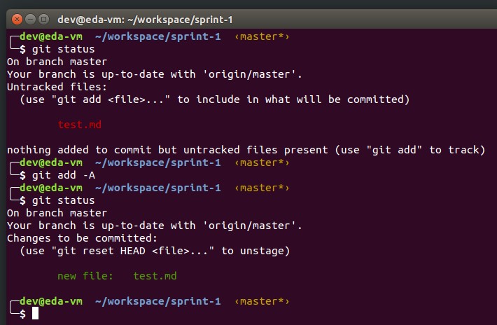<br>
  <figcaption>
    <p><strong>Figure 8:</strong> Staging the <code>test.md</code> file.</p>
  </figcaption>
</figure>

Notice that before we staged the file, git listed it as "Untracked". And red.

After we've staged the file it is listed as "Changes to be committed". And it's green. Which is nice. Unless you have red-green color blindness! Good thing that there are more indicators than just color, right?

## Step 7: Commit changes to your local repo

Now we can commit the changes. We'll need to add a "commit message" to explain what the commit is about. Commit messages are very important. Be sure you write good ones. There has been a lot of controversy about just what that means, but the general consensus seems to be that the title of the message should begin with an *imperative* verb, for example "Add", not "Added". You are telling future developers what this commit will *do* if they run it, not reporting what *you* did before you made the commit.

The message should be no more than about 50-60 characters and should not end in a period. Think of it like a title or headline. They don't end in periods, do they?

Making [good commit habits](https://xkcd.com/1296/) early will save you a lot of pain later, and will look good should you want to get involved in some of the major open source projects. They are not very forgiving about bad commit messages! Looks good for employers, too, and it's just respectful of future developers (and yourself if you come back to your code later).

So let's commit our changes to our *local* copy of the repository:

```sh
git commit -m "Add sample text"
```

<figure>
  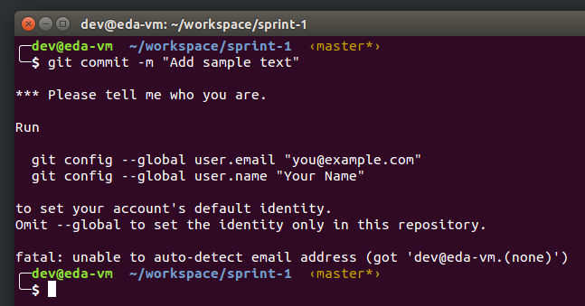<br>
  <figcaption>
    <p><strong>Figure 9:</strong> Oops. Something went wrong.</p>
  </figcaption>
</figure>

## Step 8: Add credentials and try again

Well, that didn't work as expected! This is because git wants to know who we are for the records. This is a setting you'll only need to set once (unless you back up to an earlier snapshot of the VM or re-download it). But it's easy! The error message tells you exactly what to do. So we can simply copy and paste, making the appropriate changes. (Remember that copying from the terminal in Linux uses `Control-SHIFT-c`, and pasting `Control-SHIFT-v`.)

```sh
git config --global user.email "you@example.com"
git config --global user.name "Your Name"
```

<figure>
  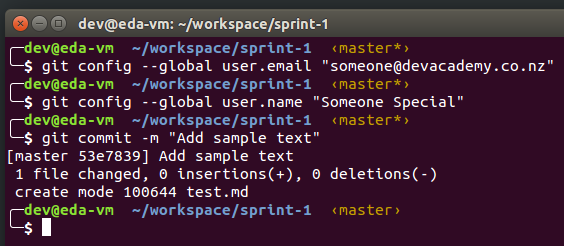<br>
  <figcaption>
    <p><strong>Figure 10:</strong> Completing our commit.</p>
  </figcaption>
</figure>

Well, that worked! Next time we can go straight to the commit. Something to note: Before we did the commit, the prompt included this text: `<master*>`. That means we're on the "master" branch of our code (more on that shortly), and the * means that we have uncommitted changes. Note that after the commit succeeds, that * goes away. So you can quickly see from the terminal both what branch you're on and whether it currently has changes to be committed.

## Step 9: Push files to GitHub

Now we can push our commited changes, which are only in our local copy of the repository, up to GitHub so they are both save and visible to others (such as your instructors). Do this often, so if you need help from a teammate or instructor, you can just pass them the URL of the page and a line number. That saves a lot of copying and pasting and confusion.

We push the changes to GitHub with a simple `git push`:

<figure>
  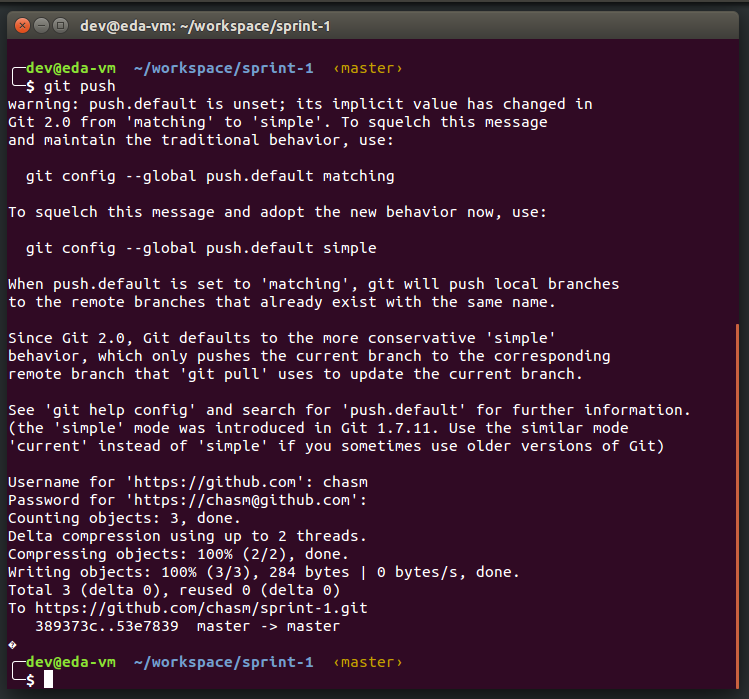<br>
  <figcaption>
    <p><strong>Figure 11:</strong> Pushing our changes to GitHub.</p>
  </figcaption>
</figure>

Hmm. Another big mess, eh? This is another setting that git requires. Well, it let us push, so maybe requires is the wrong word. But it will keep bugging us about this until we make a choice. So let's just use the newer setting:

```sh
git config --global push.default simple
```

<figure>
  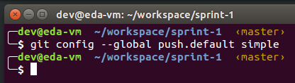<br>
  <figcaption>
    <p><strong>Figure 12:</strong> Setting the push.default for all time!</p>
  </figcaption>
</figure>

## Step 9: Create a branch

## Step 10: Create a pull request

# Code reviews

# Engineering empathy - reflection workflow


<!--
<figure>
  <br>
  <figcaption>
    <p><strong>Figure 6:</strong> The right-click context menu</p>
  </figcaption>
</figure>

Save it:

<figure>
  <br>
  <figcaption>
    <p><strong>Figure 7:</strong> The file dialog</p>
  </figcaption>
</figure>

Add some [Markdown](http://daringfireball.net/projects/markdown/syntax):

<figure>
  <br>
  <figcaption>
    <p><strong>Figure 8:</strong> Saving some changes</p>
  </figcaption>
</figure>

Now we'll stage those changes in git with `git add -A` and then we'll check the status of our staged files with `git status`:

<figure>
  <br>
  <figcaption>
    <p><strong>Figure 9:</strong> Staging the files and checking the status</p>
  </figcaption>
</figure>

Green means it's staged. (Note: if you have red-green color blindness, notice that it says "Changes to be committed". That's your cue.)

So now let's commit our changes to our *local* repository with `git commit` and a message:

<figure>
  <br>
  <figcaption>
    <p><strong>Figure 10:</strong> Error commiting the changes to the local repository</p>
  </figcaption>
</figure>

Oops. We need to tell GitHub who we are (just once). Note, to copy in Linux terminal, you must use Control-SHIFT-C. Similarly, paste is Control-SHIFT-V and cut is Control-SHIFT-X. That's because Control-c is already used. Be careful! Control-c means "cancel".

<figure>
  <br>
  <figcaption>
    <p><strong>Figure 10:</strong> Telling git who I am</p>
  </figcaption>
</figure>

OK, now we can commit:

Finally, I'll push them to GitHub with `git push`:

<figure>
  <br>
  <figcaption>
    <p><strong>Figure 10:</strong> Commiting the changes to the local repository</p>
  </figcaption>
</figure>

Finally, I'll push them to GitHub with `git push`:

<figure>
  <br>
  <figcaption>
    <p><strong>Figure 11:</strong> Pushing my changes to the remote repository on GitHub</p>
  </figcaption>
</figure>

Whoops. We have to set one more thing (then never again!). Copy the line

Now I can see those changes on GitHub (reload the page):

<figure>
  <br>
  <figcaption>
    <p><strong>Figure 12:</strong> Now my changes are visible on GitHub</p>
  </figcaption>
</figure>

Lather, rinse, repeat.
-->
