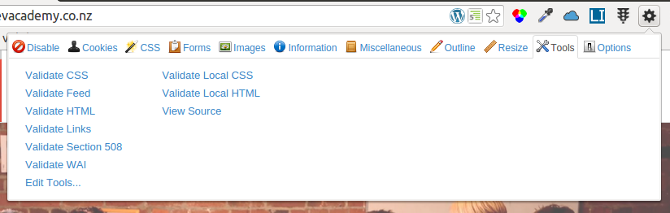

# Lints and validators

In programming, a *lint* or *linter* is "any tool that flags suspicious usage in software written in any computer language" ([Wikipedia](https://en.wikipedia.org/wiki/Lint_%28software%29)). Throughout your career, you should take advantage of any linter that's available to check your code for mistakes, errors of style, and other questionable code. Why not? It's free, and it can save you a lot of misery.

Another common tool is the *validator*, which tests whether code meets a particular standard as published by a standards organization.

In Phase 0 there are several lints and validators that will help you to write correct, standards-compliant, and even elegant code:

- [The W3C HTML validator](https://validator.w3.org/#validate_by_input)
- [The W3C CSS validator](https://jigsaw.w3.org/css-validator/#validate_by_input)
- [The WebAIM WAVE accessibility tool](http://wave.webaim.org/)
- [AccessLint](http://accesslint.com/)

We've also installed the Web Developer plugin into Chrome, which allows you to validate both local and remote HTML and CSS&mdash;along with links, accessibility, and more&mdash;from within your browser.

<figure>
   
  <figcaption>
    
<strong>Figure 1:</strong> Chrome's Web Developer plugin

  </figcaption>
</figure>

And we've installed lints into Sublime Text 3, including CSSLint, ESLint (JavaScript 2015), JSON, Sass/SCSS lints (for CSS preprocessing), and the [standard.js](http://standardjs.com/rules.html) lint, which defines the JavaScript style guide we'll be using throughout Phase 0.

You can also lint your JSON online with [JSONLint](http://jsonlint.com/). Haven't really found a truly up-to-date lint for the newer "ES6" JavaScript online, but the one installed in Sublime Text 3 is state-of-the-art.

Use them!
