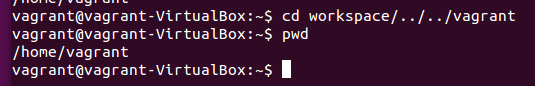
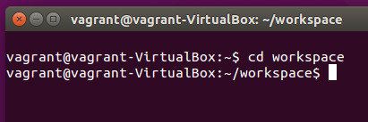
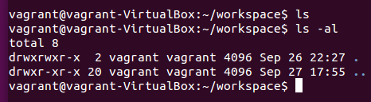

# The terminal

You'll be using the terminal regularly throughout your career as a developer.

Some people memorize a lot of commands for the terminal, and use terminal-based text applications (e.g., vim or emacs). If you invest enough time in such tools, you can become extremely fast. But it's a big up-front investment, kind of like learning a musical instrument.

Conversely, you can use the terminal sparingly and only when necessary, and then use graphical user interface (GUI) applications for most of your work. Because time is limited in this course, we'll focus on the GUI applications and will make minimal use of the terminal. But feel free to practice in your spare time if you want to become a command line wizard.

There are a small set of commands you'll need to get started with the terminal.

## pwd

You can use the "print working directory" command, `pwd`, to see which directory you are currently working in. The terminal is always pointing to a particular directory (folder) in your filesystem. Often, you'll see an indication of this directory in the "prompt": the text immediately above and/or to the left of the line on which you type. The "prompt" (to prompt you to type) varies depending on how your terminal is set up, but it appears every time it's your turn to type. The simplest prompt is just `$`.

Here's an example of running `pwd` on the virtual machine you're currently downloading:

<figure>
  <br>
  <figcaption>
    <p><strong>Figure 1:</strong> pwd</p>
  </figcaption>
</figure>

Notice how the prompt (dev@eda: ~) comes right back again? That's why we call it the *prompt*. (Uh, not because it comes back quickly, but because it keeps prompting you for input.) Also notice that after we typed `pwd` and hit Enter, the terminal responded by outputting the current working directory (/home/dev) to the next line. That's how the terminal works.

Let's try a few more commands:

## cd

We can move up or down directories (folders) by calling "change directory" (`cd`). There are two special names for folders. The single dot `.` represents the current directory. The double dot `..` represents the parent directory. The "path separator" (between folders) is the /.

So we can move multiple folders at once by stringing them together with /:

<figure>
  <br>
  <figcaption>
    <p><strong>Figure 2:</strong> cd</p>
  </figcaption>
</figure>

Here we went down into the `workspace` folder (which is a subfolder in the current foldler), then back up two folders to the parent of the current folder, and then back into the current folder (`/home/dev`&mdash;our "home" folder). Which leaves us . . . wait for it . . . *right back where we started!* Why would we do this? We wouldn't. It's pointless.

But nevertheless there *is* a point here, which is that we can combine folder names and .. to move all through the folder hierarchy with a single command. Now let's `cd` into our `workspace` folder. This is where you'll do all your work for this course. Keep it all here.

<figure>
  <br>
  <figcaption>
    <p><strong>Figure 3:</strong> cd workspace</p>
  </figcaption>
</figure>

Hey, look! Our prompt has changed. What does all that mean, anyway?

Well, "dev" is our username and "eda" is the name of our computer.

The tilde (~) represents our home folder, in this instance `/home/dev`. And we're now in the `workspace` folder *inside* our home folder, hence `~/workspace`. And the $ is the standard prompt. This will change if we start an application, such as a JavaScript REPL (read, evaluate, print loop), but we'll explain that when we come to it.

## ls

What if we want to list the files and folders in this folder? We can do that with the list (`ls`) command. If we want to see more than just the names, we can add "flags" to the command, preceded with a hyphen. The `a` flag means "all": show all the files, even the hidden ones (files with names starting with a `.` are hidden usually). The "l" flag means use a long listing format, which gives us extra information. We can combine them thus:

<figure>
  <br>
  <figcaption>
    <p><strong>Figure 4:</strong> ls and ls -al</p>
  </figcaption>
</figure>

Notice that the `ls` command didn't return anything. That's because our folder is currently empty. But when I use the `-a` flag, I see the hidden files and folders (beginning with `.`), too. That includes&mdash;and it is no accident that these both start with a dot&mdash;the current folder `.` and the parent folder `..`.

By using the `-l` flag as well, I tell the terminal to list more information. So here I see this line for the current folder:

```bash
drwxrwxr-x  2 dev dev 4096 Sep 26 22:27 .
```

This tells me a lot, actually, though you don't need to know it all.

- `d` means this is a directory
- `rwx` the first time means that the owner of this folder has read, write, and execute privileges on it
- `rwx` the second time means that the group to which the owner belongs also has read, write, and execute privileges
- `r-x` means that all other users can read or execute, but cannot write to this folder
- `2` no one really knows what this number means; it probably just got lost and wandered in here for company
- `dev` the first time is the user
- `dev` the second time is the user's "group"
- `4096` is the file size in bytes
- `Sep 26 22:27` is an indication that the author was doing this at the very last minute
- `.` is the name of the folder: the *current* folder

## exit

OK, that's enough for the moment. You'll pick these up quickly as you go along. Google around and you'll find plenty of cheat sheets of commands. Print one out and keep it handy, or add a bookmark to it in your browser.

To get out of the shell (terminal), just type `exit` and hit Enter.

## Resources

- [Cheat sheet](http://cli.learncodethehardway.org/bash_cheat_sheet.pdf) (that'll keep ya busy)


