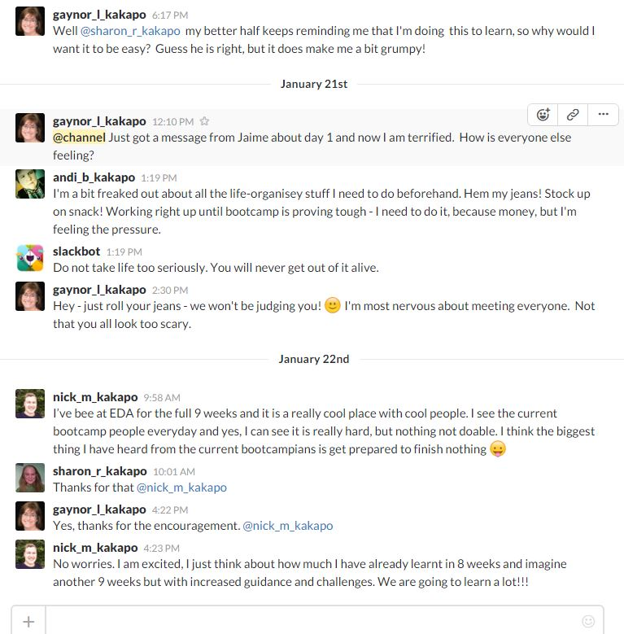

# Accountability Groups

In Phase 0, you will have groups of 3-5 people to connect with each week. These groups aim to give you a core group of people you can work with, ask questions of, and generally get to know better.

Each week, you will be required to send your accountability group an update on how you're doing. In some weeks, you will also be required to complete challenges with your accountability group as well.

Although you will be required to use the discussion groups on slack, you can also meet with your accountability group online or create your own method of group communication with them to connect more often. These are your groups, so be active in participating with them. Phase 0 can feel lonely if you let yourself do only the required pairings, etc., but you will get a lot more out of the program if you connect with others and work with them!

If you have additional questions about accountability groups, please send your facilitator a message

Here's a snapshot of an accountability group working to help people on their learning journey:

