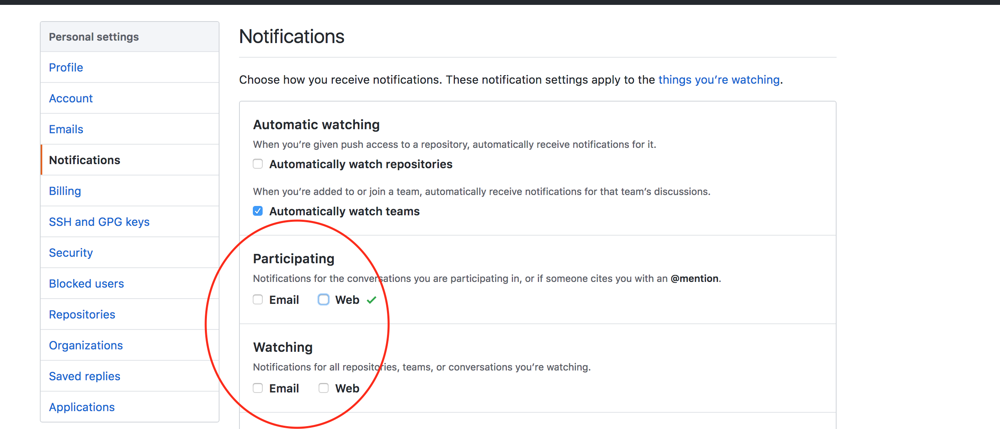

# Create Accounts!

A couple of things to help us along:

1. **Use your first name as part of your username wherever possible**
2. **Open links in new tabs.** GitHub repos have a lot of links. We recommend right-clicking (or holding the command key (mac) / control key (win) when clicking) to open links in new tabs.
3. **Skim read Context: sections.** We use Context: to indicate the information is useful but not essential for completing the task right now.

## Accounts you need

1. GitHub
2. Waffle.io
3. Slack

---

### GitHub

1. Click "sign up" (top right corner)
2. Choose a username that:
    * includes your first name
    * is something you'll be happy for employers to see
3. Update profile (click image in the top right corner, click Settings > Upload new picture)
    * Add a profile image and name
4. __Important__ Update notifications (Click Notifications > Uncheck all boxes watching and participating boxes). If you do not change this setting you will receive multiple emails from GitHub every time we send you assignments. 
4. Check your email and click the validation link

 

<figure>
   
  <figcaption>
    
<strong>Figure 1:</strong> how you receive notifications in GitHub

  </figcaption>
</figure>

> Context: GitHub will be where you keep all of your code from EDA and becomes your technical resume when applying for positions. The most popular form for GitHub usernames is to use "snake-case": all lowercase letters with words separated by hyphens, e.g., bobs-yer-uncle. Remember that this name will be used by you professionally, so don't make the mistake of  using something you wouldn't want potential employers or clients to see. 'anahi-hiyu' is good. 'eda-2015-sam-coder' is not so good. Make sure it sends the right message.
---

### Waffle.io
1. Be sure to be signed in to GitHub first.  
2. Visit [Waffle.io](https://waffle.io/) and select Sign Up
3. Select "private and public" repos
3. Click "authorise"

---

### Slack
1. [Click on this link](https://edaslackinvite.herokuapp.com/) to receive an invite to slack
2. Go to your email inbox and open the email sent to you. Click 'join now'.
3. Use the **naming convention** to create a username: firstname_lastnameINITIAL_cohort e.g. anahera_p_kakapo.
4. Download the [desktop app](https://slack.com/app)
5. Login to the slack org enspiral-dev-academy using the desktop app
5. Add a picture of your self (drop down at the top left of the app, under \'profile and account\')
6. Click on "channels" to find your Phase 0 channel
7. Join the **#phase0_auckland** or **#phase0_wellington** channel
8. Join the **#auckland** or **#wellington** space channels

>Context: For more information see the [EDA Slack user guide](/tools/slack/README.md).
