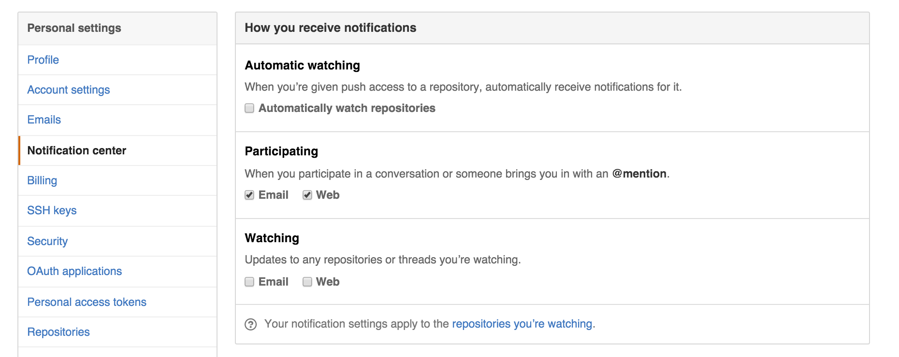

# Create Accounts!

A couple of things to help us along:

1. **Use your first name as part of your username wherever possible.** (To help us all recognise each other)
2. **Open links in new tabs.** GitHub repos have a lot of links. We recommend right-clicking (or holding the command key (mac) / control key (win) when clicking) to open links in new tabs.
3. **Skim read TLDR sections.** We use TLDR to indicate the information is useful but not essential for completing the task right now.

## Accounts you need

1. Github
2. Waffle.io
3. Slack

 

## Github

> TLDR  GitHub will be where you keep all of your code from EDA and becomes your technical resume when applying for positions. The most popular form for github usernames is to use "snake-case": all lowercase letters with words separated by hyphens, e.g., bobs-yer-uncle. Remember that this name will be used by you professionally, so don't make the mistake of  using something you wouldn't want potential employers or clients to see. 'anahi-hiyu' == good. 'eda-2015-sam-coder' == not so good. Make sure it sends the right message.

 

1. Click "sign up" (top right corner)
2. Choose a username that:
    * includes your first name
    * is something you'll be happy for employers to see
3. Update profile (hover top right corner, click your profile > edit)
    * Add a profile image and name
    * Update notifications: ` Uncheck Watching` boxes. `Check Particpating` boxes

4. Accept invitation to your cohort's github team - your facilitator will send this to you either during the call or after.

 

<figure>
   
  <figcaption>
    
<strong>Figure 1:</strong> how you receive notifications in github

  </figcaption>
</figure>

 

## Waffle.io
1. Sign up to [Waffle.io](https://waffle.io/) using your GitHub account
2. Select "private and public" repos

> TLDR  
> This [tutorial on assignment management in waffle](https://vimeo.com/147405661) is useful if you'd like to help on navigating waffle. The password is `eda`.

## Slack
1. [Click on this link](https://edaslackinvite.herokuapp.com/) to receive an invite to slack
2. Go to your email inbox and open the email sent to you. Click 'join now'.
3. Use the **naming convention** to select a username: firstname_lastnameINITIAL_cohort e.g. anahera_p_kakapo.
4. Download the [desktop app](https://slack.com/app) and login.
5. Click on "channels" to find your cohort.

>TLDR
>For more information see the [EDA Slack user guide](/tools/slack/README.md).

