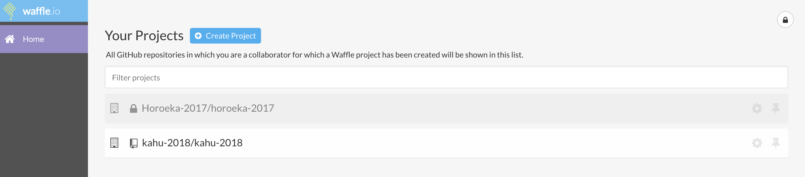
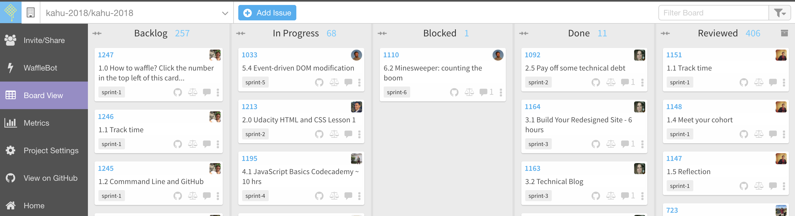
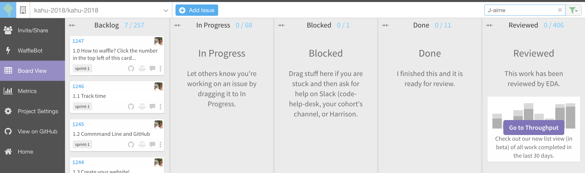
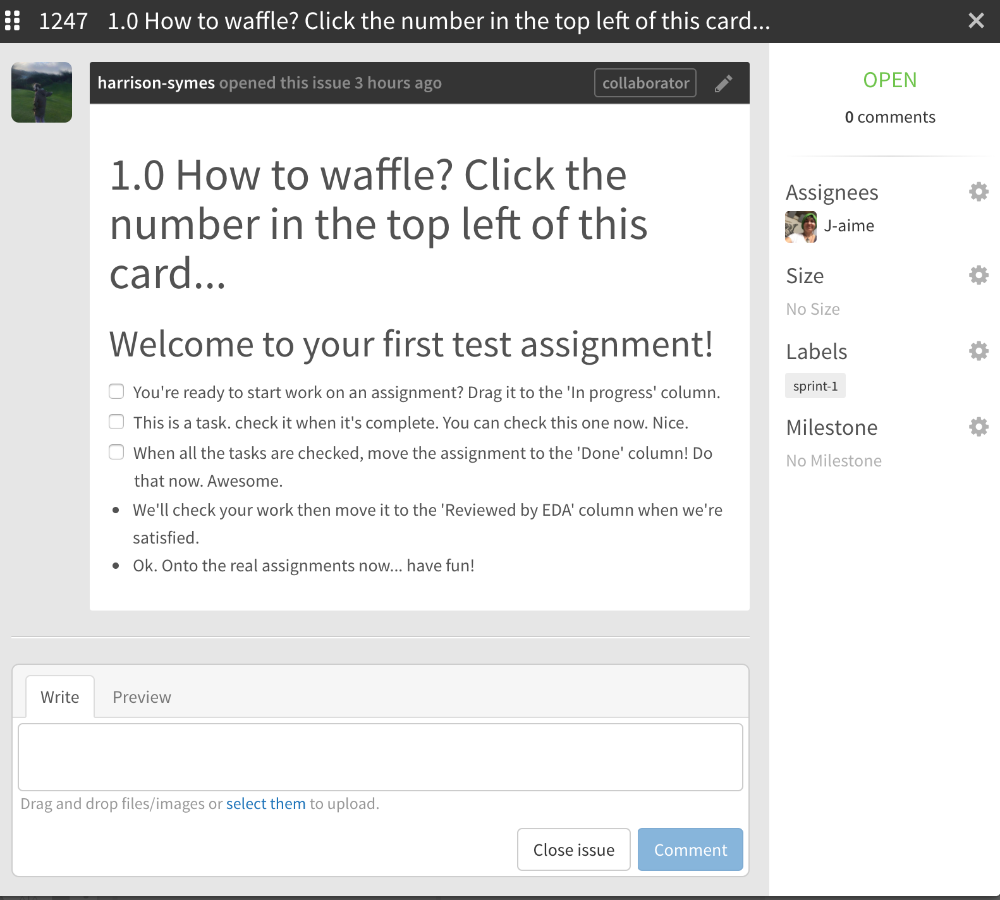

# Get your first assignments

1. Accept the invitation to join your GitHub Org from your email inbox.
2. Go to [waffle.io](https://waffle.io/)
3. Under 'Your Projects' select your cohort (figure 1 and 2)
4. Use the filter and enter your GitHub Username (figure 3)
5. Clcik on a ticket and follow the instructions within (figure 4)

##### Notes  
- GitHub orgs are named after native trees and native birds. It contains a number of repositories (repo)
- A GitHub repo is similar to a digital directory or storage space, where course information is kept
- Waffler is a visual interface for that GitHub repository
- You will need to filter out your assignments (see images below)   

<figure>
  <figcaption>
    
<strong>Figure 1:</strong> Select your cohort under 'Your Projects'

  </figcaption>
   
</figure>

<figure>
  <figcaption>
    
<strong>Figure 2:</strong> Unfiltered board view. All user's assignments visible.

  </figcaption>
   
</figure>

<figure>
  <figcaption>
    
<strong>Figure 3:</strong> Filtered view - Only user's assignments visible.

  </figcaption>
   
</figure>

<figure>
 <figcaption>
    
<strong>Figure 4:</strong> Example of first waffle ticket

  </figcaption>
  
</figure>
