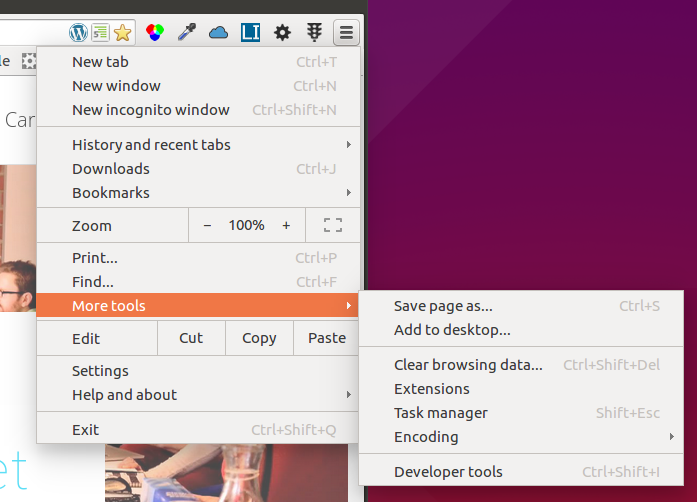

# Chrome Developer Tools

The Developer Tools in Google Chrome is a web app that helps web developers debug problems and try new things quickly. Other browsers have similar features, but many designers and developers prefer Chrome for its robust developer tools and support of web standards.

The Chrome web browser contains a host of tools that make your life as a developer much easier. Take the time to get to learn them and you'll relieve or mitigate a lot of the pain of web development, allowing you to focus on the pleasure.

## Developer Tools in Action

Both these free tutorials are an excellent introduction to Dev tools. Watch and follow along or read the over overview below:

- [Watch: A re-introduction to Dev tools](http://www.paulirish.com/2011/a-re-introduction-to-the-chrome-developer-tools/)
- [Try: Discover Dev Tools](http://discover-devtools.codeschool.com/)

Additional practice and resources:

- [Watch: Secrets of the Chrome Developer Dev Tools](https://vimeo.com/53073654)
- [Watch/Try: Treehouse Chrome Developer Tools](http://teamtreehouse.com/library/debugging-a-web-app-with-chrome-dev-tools)

<figure>
   
  <figcaption>
    
<strong>Figure 1:</strong> Chrome

  </figcaption>
</figure>

We can click on the "hamburger menu" and select More Tools > Developer Tools. Or we can use Control-Shift-I to open the tools. Or we can right click on the page and select "Inspect element" from the Context: menu:

<figure>
   
  <figcaption>
    
<strong>Figure 2:</strong> Dev tools from the hamburger menu

  </figcaption>
</figure>

<figure>
   
  <figcaption>
    
<strong>Figure 3:</strong> Dev tools from the Context: menu

  </figcaption>
</figure>

Either way, we'll open a frame with a ton of information. We'll just point out a couple of things. The first is that there is a tab called "Elements" which shows the current HTML. I say "current" because scripts can change the HTML (you'll be doing that this week), so the HTML as originally loaded may no longer be the actual HTML. Here you see the actual HTML. To see what was downloaded, select "View source" from the Tools menu or use Control-u to open a new tab with the raw page source.

To the right in the Elements tab you'll see the CSS properties. Play around with this. You'll be surprised how much information is here.

<figure>
   
  <figcaption>
    
<strong>Figure 4:</strong> The Developer Tools Elements tab

  </figcaption>
</figure>

The other tab you'll want to use right away is the Console tab. From the console you can see any error messages, but you can also interact with the page using JavaScript. We'll be using that feature a lot, too.

<figure>
   
  <figcaption>
    
<strong>Figure 5:</strong> The Developer Tools Console tab

  </figcaption>
</figure>

Notice how as we type, we get a list of possible commands. Nice, eh?

## Chrome extensions we'll use

You'll need the following extensions in Chrome. They should already be installed in the Vagrant machine.

1. [Accessibility Developer Tools](https://chrome.google.com/webstore/detail/accessibility-developer-t/fpkknkljclfencbdbgkenhalefipecmb)
2. [Color Contrast Analyzer](https://chrome.google.com/webstore/detail/color-contrast-analyzer/dagdlcijhfbmgkjokkjicnnfimlebcll)
3. [ColorZilla](https://chrome.google.com/webstore/detail/colorzilla/bhlhnicpbhignbdhedgjhgdocnmhomnp)
4. [HTML5 Outliner](https://chrome.google.com/webstore/detail/html5-outliner/afoibpobokebhgfnknfndkgemglggomo)
5. [JSONView](https://chrome.google.com/webstore/detail/jsonview/chklaanhfefbnpoihckbnefhakgolnmc)
6. [Live HTTP Headers](https://chrome.google.com/webstore/detail/live-http-headers/iaiioopjkcekapmldfgbebdclcnpgnlo)
7. [Lorem Ipsum Generator](https://chrome.google.com/webstore/detail/lorem-ipsum-generator-def/mcdcbjjoakogbcopinefncmkcamnfkdb)
8. [Postman](https://chrome.google.com/webstore/detail/postman/fhbjgbiflinjbdggehcddcbncdddomop)
9. [Wappalyzer](https://chrome.google.com/webstore/detail/wappalyzer/gppongmhjkpfnbhagpmjfkannfbllamg)
10. [Web Developer](https://chrome.google.com/webstore/detail/web-developer/bfbameneiokkgbdmiekhjnmfkcnldhhm)
